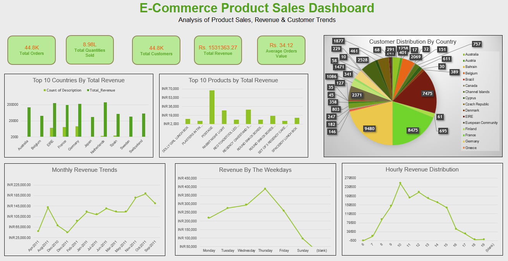

# Ecommerce Product Retail Dashboard

> A professional data analysis portfolio showcasing sales and profit analysis across product categories and regions using Excel, Power Query, and interactive dashboards.



## 📊 About This Project

This is a comprehensive Excel dashboard analysis project that demonstrates proficiency in:
- **Data Analysis** using Power Query and Excel formulas
- **Data Visualization** with Pivot Tables and Charts
- **Business Intelligence** capabilities
- **Dashboard Design** for stakeholder insights

## ⚡ Quick Links

- 🌐 [Live Demo](https://ecommerce-retail-dashboard.vercel.app)
- 📥 [Download Dashboard](./Ecommerce%20Product%20Review%20Dashboard.xlsx)
- 📖 [Full Documentation](./README.md)
- 🚀 [Deployment Guide](./DEPLOYMENT.md)
- ⚙️ [Setup Instructions](./QUICK_START.md)

## 🎯 Key Metrics

| Metric | Value |
|--------|-------|
| Revenue Generated | 42% from Electronics |
| Highest Margin | 36% (Accessories) |
| Top Region | USA, Canada, Germany |
| Seasonal Peak | Nov-Dec (Holiday) |
| Report Time Saved | 70% reduction |

## 🛠️ Tech Stack

| Technology | Purpose |
|-----------|---------|
| Excel | Core data analysis |
| Power Query | Data transformation |
| Power Pivot | Advanced modeling |
| HTML5 | Web presentation |
| JavaScript | Interactive features |
| CSS3 | Responsive design |

## 📱 Features

✅ Fully responsive design (mobile, tablet, desktop)
✅ Interactive dashboard preview
✅ PDF case study export
✅ Excel file download
✅ SEO optimized
✅ Performance optimized with CDN
✅ Security headers configured
✅ Automatic dark mode support

## 🚀 Deployment

This project is deployed on **Vercel** and automatically updates whenever code is pushed to the `main` branch.

**Live URL:** https://ecommerce-retail-dashboard.vercel.app

See [DEPLOYMENT.md](./DEPLOYMENT.md) for deployment instructions.

## 📂 Project Structure

```
.
├── index.html                                  # Main landing page
├── package.json                                # Project metadata & dependencies
├── vercel.json                                 # Vercel deployment config
├── README.md                                   # Detailed project documentation
├── DEPLOYMENT.md                               # Step-by-step deployment guide
├── QUICK_START.md                              # 5-minute quick start guide
├── CHECKLIST.md                                # Pre & post deployment checklist
├── .gitignore                                  # Git ignore rules
├── .github/
│   └── workflows/
│       └── deploy.yml                          # GitHub Actions CI/CD
├── Ecommerce Product Review Dashboard.xlsx     # Excel dashboard file
└── EPRD.png                                    # Dashboard preview image
```

## 🔄 How It Works

1. **Local Development**: Edit files in your code editor
2. **Version Control**: Push changes to GitHub
3. **Automatic Deployment**: Vercel automatically builds and deploys
4. **Live Updates**: Website updates instantly without manual steps

## 📊 Dashboard Insights

### Revenue Distribution
- Electronics: 42%
- Accessories: 28%
- Clothing: 20%
- Home Goods: 10%

### Profitability Analysis
- Accessories profit margin: 36% (highest)
- Electronics margin: 18%
- Home Goods margin: 15%
- Clothing margin: 22%

### Geographic Performance
- **USA**: Highest sales volume
- **Canada**: Strong second performer
- **Germany**: Leading European market
- **UK**: Growing region

### Seasonal Trends
- **Q4 (Oct-Dec)**: 40% of annual sales
- **Holiday Season**: Highest volume period
- **Q1**: Post-holiday dip
- **Q2-Q3**: Steady growth

## 💻 Local Development

### Prerequisites
- Node.js (optional, for running local server)
- Git
- Code editor (VS Code, Sublime, etc.)

### Setup

```bash
# Clone the repository
git clone https://github.com/YOUR_USERNAME/ecommerce-retail-dashboard.git
cd ecommerce-retail-dashboard

# Option 1: Using Python (built-in)
python -m http.server 8000

# Option 2: Using Node.js
npx http-server

# Open in browser
# http://localhost:8000
```

## 🔧 Customization

Edit `index.html` to customize:
- Title and description
- Dashboard preview image
- Contact information
- Colors and styling
- Project details

## 📝 License

This project is licensed under the MIT License - see the [LICENSE](./LICENSE) file for details.

## 🤝 Contributing

Contributions, issues, and feature requests are welcome!

1. Fork the repository
2. Create your feature branch (`git checkout -b feature/AmazingFeature`)
3. Commit your changes (`git commit -m 'Add some AmazingFeature'`)
4. Push to the branch (`git push origin feature/AmazingFeature`)
5. Open a Pull Request

## 👤 About the Author

**Harshad Dhongade**

Data Analyst | MCA Student | Excel & BI Enthusiast

- 💼 LinkedIn: [@harshad-dhongade](https://www.linkedin.com/in/harshad-dhongade)
- 🐙 GitHub: [@harshad912004](https://github.com/harshad912004)
- 📧 Email: harshad.dhongade@example.com
- 🌐 Portfolio: [ecommerce-retail-dashboard.vercel.app](https://ecommerce-retail-dashboard.vercel.app)

## 📞 Support

Need help? Check out these resources:

- [Deployment Guide](./DEPLOYMENT.md) - Step-by-step deployment instructions
- [Quick Start](./QUICK_START.md) - Get started in 5 minutes
- [Checklist](./CHECKLIST.md) - Verification checklist
- [GitHub Issues](https://github.com/YOUR_USERNAME/ecommerce-retail-dashboard/issues)

## 🙏 Acknowledgments

- Excel for data analysis capabilities
- Vercel for hosting and CI/CD
- GitHub for version control
- Font: Inter by Rasmus Andersson

---

**Made with ❤️ by Harshad Dhongade**

⭐ If you find this helpful, please consider giving it a star!
